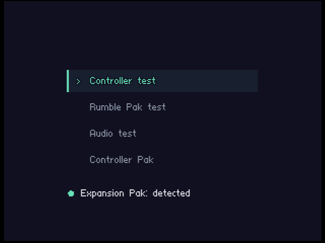
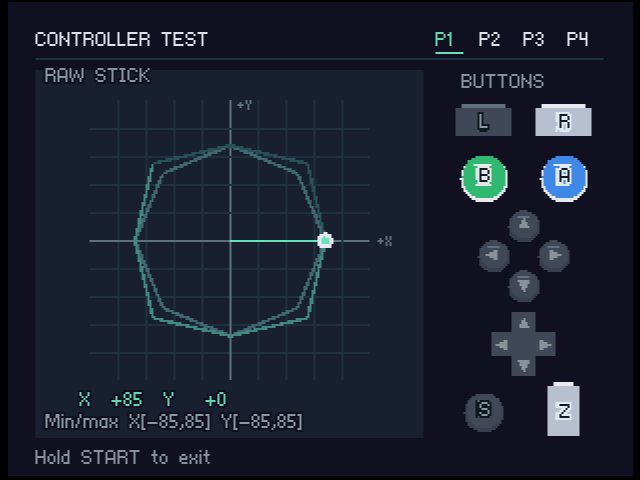
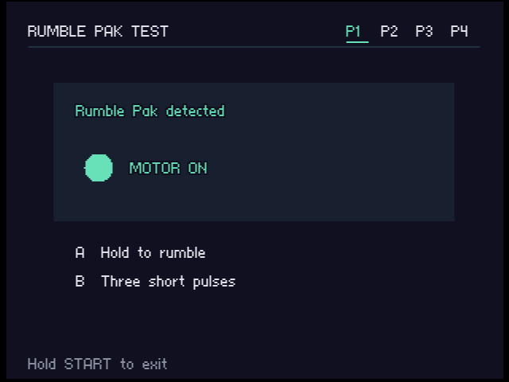
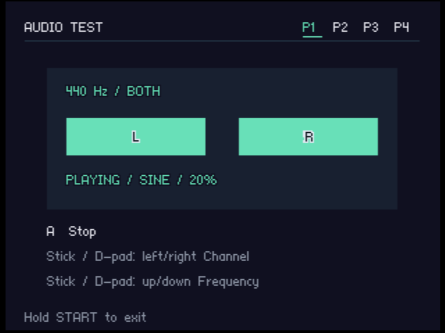
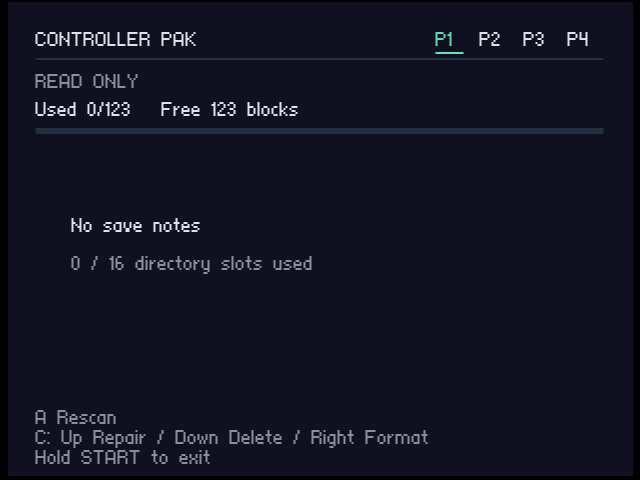

# N64 Utilities

A utility ROM for testing Nintendo 64 hardware.

- **Controller test:** buttons, joystick position, movement trail, and min/max readings across all four ports.
- **Rumble Pak test:** manual rumble and pulse tests.
- **Audio test:** 220 Hz, 440 Hz, and 1 kHz tones with left, right, or stereo output.
- **Controller Pak:** browse saves and capacity, repair metadata, delete saves, and format.
- **Expansion Pak:** detection status on the main menu.

Download **n64-util.z64** from the [latest release](https://github.com/acheronfail/n64-util-rom/releases/latest).

## Screenshots

